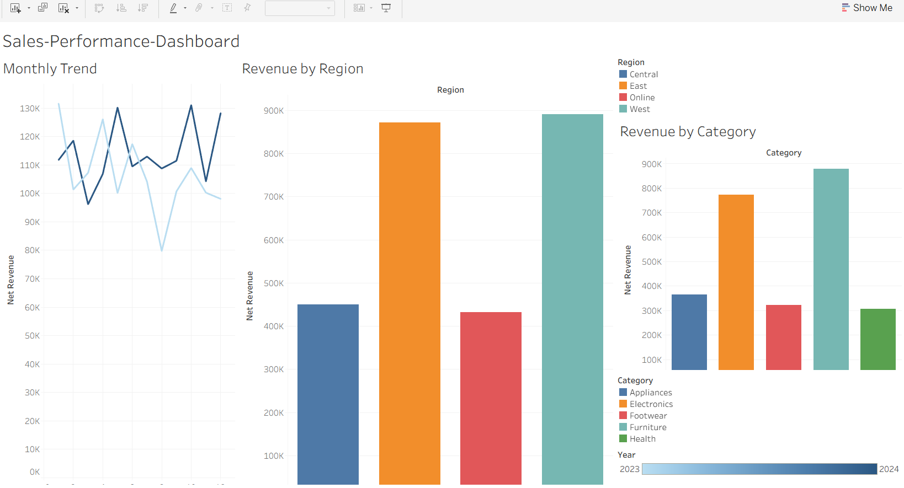

# 🛒 Retail Sales Performance Dashboard


> End-to-end retail analytics system that transforms 5,000 raw transactions into actionable business insights using SQL, Python, and Tableau.

---

## 📊 Dashboard Preview



---

## 📌 Project Overview

This project models a real retail analytics workflow:

**Raw CSV data → Python ETL pipeline → MySQL star schema → SQL analysis → Tableau dashboard**

### Business questions answered:
- Which regions and stores drive the most revenue?
- What products are underperforming vs targets?
- How does sales performance compare month-over-month and year-over-year?
- Which sales reps are hitting quota and which need support?
- What are the peak shopping periods and seasonal trends?

---

## 💡 Key Insights

| Metric | Finding |
|--------|---------|
| Top regions | East & West drive **68% of total revenue** |
| Highest revenue category | Furniture at **$884K** |
| Most units sold | Electronics with **10,319 units** |
| Best profit margin | Health category at **78.7%** |
| Top sales rep | Carol White — **$202,898** total sales |

---

## 🗄️ Data Model (Star Schema)

```
                ┌──────────────┐
                │  dim_date    │
                └──────┬───────┘
                       │
┌──────────────┐  ┌────┴──────────┐  ┌──────────────┐
│  dim_product │──│  fact_sales   │──│  dim_store   │
└──────────────┘  └────┬──────────┘  └──────────────┘
                       │
                ┌──────┴───────┐
                │  dim_sales_  │
                │     rep      │
                └──────────────┘
```

A star schema was chosen for optimal query performance on analytical (OLAP) workloads.

---

## 📈 Sample Query Results

### Regional Revenue Ranking
| Rank | Region  | Net Revenue | Units Sold | Revenue Share |
|------|---------|-------------|------------|---------------|
| 1    | East    | $914,449    | 9,543      | 34.2%         |
| 2    | West    | $901,025    | 9,116      | 33.7%         |
| 3    | Online  | $442,384    | 4,735      | 16.5%         |
| 4    | Central | $418,727    | 4,340      | 15.6%         |

### Product Category Performance
| Category    | Net Revenue | Units Sold | Gross Profit | Margin |
|-------------|-------------|------------|--------------|--------|
| Furniture   | $884,877    | 3,813      | $629,107     | 71.1%  |
| Electronics | $795,380    | 10,319     | $590,501     | 74.2%  |
| Appliances  | $377,956    | 3,395      | $271,566     | 71.9%  |
| Footwear    | $325,107    | 3,500      | $227,465     | 70.0%  |
| Health      | $293,265    | 6,707      | $230,722     | 78.7%  |

---

## 🛠️ Tech Stack

| Layer | Technology |
|-------|------------|
| Database | MySQL (Star Schema) |
| ETL | Python 3.10+, Pandas |
| Analysis | SQL Window Functions, CTEs, Aggregates |
| Visualization | Tableau, Excel |
| Version Control | Git / GitHub |

---

## 🗂️ Project Structure

```
retail-sales-performance-dashboard/
│
├── sql/
│   ├── schema.sql              # Star schema — fact + dimension tables
│   └── analysis_queries.sql    # Revenue, region, product & rep analysis
│
├── python/
│   ├── etl_pipeline.py         # Extract → Transform → Load pipeline
│   ├── generate_csv.py         # Generates CSV without MySQL dependency
│   └── sales_summary.py        # Generates summary CSV for Tableau input
│
├── data/
│   ├── sample_sales_data.csv   # Sample dataset (anonymized)
│   └── tableau_dashboard.png   # Dashboard screenshot
│
└── README.md
```

---

## ⚡ Quick Start

### Option 1 — Generate CSV directly (no database needed)
```bash
git clone https://github.com/satyamthakur115/retail-sales-performance-dashboard.git
cd retail-sales-performance-dashboard
pip install pandas
python python/generate_csv.py
```

### Option 2 — Full MySQL setup
```bash
mysql -u root -p < sql/schema.sql
pip install pandas numpy mysql-connector-python faker
python python/etl_pipeline.py
python python/sales_summary.py
```

---

## 🔍 Key SQL Techniques Used

- Star schema design for OLAP-optimized querying
- Window functions: `RANK`, `DENSE_RANK`, `LAG`, `LEAD`, `AVG OVER`
- CTEs for readable, maintainable multi-step analysis
- `GROUP BY ROLLUP` for hierarchical subtotals
- Conditional aggregation with `CASE WHEN` inside `SUM/COUNT`
- Indexes on foreign keys and date columns for sub-second query response

---

## 📬 Connect

**Satyam Thakur** — Data Analyst

[](https://linkedin.com/in/YOUR-LINKEDIN-URL)
[](https://github.com/satyamthakur115)
